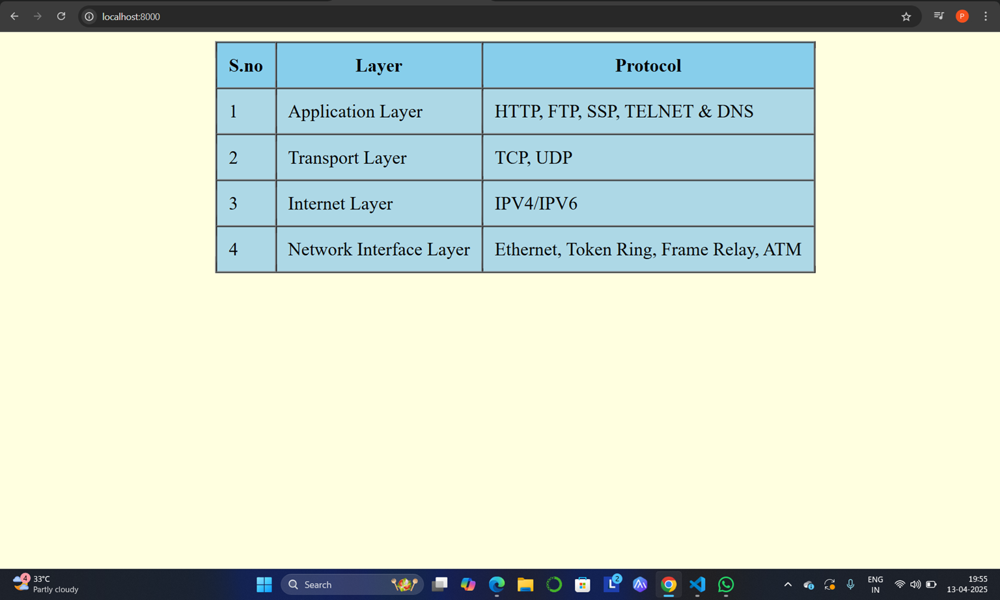

# EX01 Developing a Simple Webserver
## Date:13.04.2025

## AIM:
To develop a simple webserver to serve html pages and display the list of protocols in TCP/IP Protocol Suite.

## DESIGN STEPS:
### Step 1: 
HTML content creation.

### Step 2:
Design of webserver workflow.

### Step 3:
Implementation using Python code.

### Step 4:
Import the necessary modules.

### Step 5:
Define a custom request handler.

### Step 6:
Start an HTTP server on a specific port.

### Step 7:
Run the Python script to serve web pages.

### Step 8:
Serve the HTML pages.

### Step 9:
Start the server script and check for errors.

### Step 10:
Open a browser and navigate to http://127.0.0.1:8000 (or the assigned port).

## PROGRAM:
```html
from http.server import HTTPServer, BaseHTTPRequestHandler

content = """ 
<!DOCTYPE html>
<html>
<head>
    <title>Saveetha Engineering College</title>
</head>
<body bgcolor="lightyellow">
    <center>
    <table border="1" cellpadding="10" cellspacing="0" bgcolor="lightblue">
        <tr bgcolor="skyblue"><th>S.no</th><th>Layer</th><th>Protocol</th></tr>
        <tr>
            <td>1</td>
            <td>Application Layer</td>
            <td>HTTP, FTP, SSP, TELNET & DNS</td>
        </tr>
        <tr>
            <td>2</td>
            <td>Transport Layer</td>
            <td>TCP, UDP</td>
        </tr>
        <tr>
            <td>3</td>
            <td>Internet Layer</td>
            <td>IPV4/IPV6</td>
        </tr>
        <tr>
            <td>4</td>
            <td>Network Interface Layer</td>
            <td>Ethernet, Token Ring, Frame Relay, ATM</td>
        </tr>
    </table>
    </center>
</body>
</html>
"""

class myhandler(BaseHTTPRequestHandler):
    def do_GET(self):
        print("request received")
        self.send_response(200)
        self.send_header('content-type','text/html; charset=utf-8')
        self.end_headers()
        self.wfile.write(content.encode())

server_address = ('', 8000)
httpd = HTTPServer(server_address, myhandler)
print("my webserver is running...")
httpd.serve_forever()
```


## OUTPUT:




## RESULT:
The program for implementing simple webserver is executed successfully.
